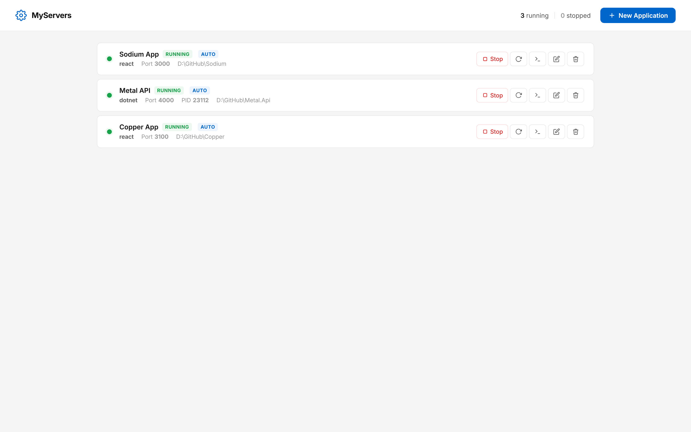

# MyServers

A developer productivity tool for managing and hosting local web applications. Build, run, and monitor all your projects — .NET, Node.js, React, Angular, Vue, and more — from a single lightweight dashboard.

Stop juggling terminals. One app to build, host, and watch them all.

**Single 2MB executable. No runtime dependencies. System tray integration. Built with Rust.**

---

## Screenshot



## Features

- **One-click build & run** — Add your project, pick a type, and hit Start. Build steps and run command execute automatically.
- **Local hosting manager** — Host multiple apps on different ports simultaneously from one place.
- **Multi-framework presets** — .NET, Node.js, React, Next.js, Angular, Vue, Express with smart defaults (customizable via `presets.json`).
- **Static file serving** — Serve React/Angular/Vue build output directly without extra tools.
- **Live logs with color** — Runtime and build output with clickable URLs, timestamped lines, and color-coded errors/warnings.
- **System tray** — Runs in background. Start All, Stop All, or Quit from the tray menu.
- **Auto-start** — Flag apps to start automatically when MyServers launches.
- **Persistent logs** — Export or copy logs. File-based logs stored per app with timestamps.
- **Native file dialogs** — Windows folder/file picker for selecting project directories.
- **Zero config** — No YAML, no Docker, no config files. Everything is configured through the UI.
- **Portable** — Single `.exe` with all HTML/CSS/JS embedded. App data stored in `%APPDATA%\MyServers\`.

## Quick Start

1. Download `myservers.exe` from [Releases](../../releases).
2. Run it. The dashboard opens at `http://localhost:1234`.
3. Click **New Application**, select your project type, browse to your project folder.
4. Hit **Save**, then **Start**.

That's it. Your app is built and running.

## How It Works

Each application you add has:

| Field | Description |
|-------|-------------|
| **Name** | Display name for the dashboard |
| **Project Directory** | Folder where all commands run (Browse to select) |
| **Type** | .NET, Node.js, React, Next.js, Angular, Vue, Express (driven by `presets.json`) |
| **Serve Mode** | `Command` (run a process), `Static Folder` (serve files), or `Script File` |
| **Port** | Port number — auto-injected as `PORT` env var (or `ASPNETCORE_URLS` for .NET) |
| **Build & Run Command** | Commands that run in order — last line is the run command (for Command mode) |
| **Environment Variables** | KEY=VALUE pairs passed to the process |
| **Auto-start** | Start this app automatically when MyServers launches |

When you select a project type, all fields are pre-filled with recommended defaults.

### Static Serving

For React, Angular, and Vue apps, select **Static Folder** as serve mode and point it to your build output (`./build`, `./dist`, etc.). MyServers serves the files directly with SPA fallback — no need for `npx serve` or `http-server`.

## Prerequisites

### To run (end users)
- Windows 10/11 (64-bit)
- No other dependencies — it's a self-contained executable

### To build from source
- **Rust** (stable) — [Install via rustup](https://rustup.rs)
- **MSYS2 + MinGW** — for the GNU toolchain on Windows
  ```
  winget install MSYS2.MSYS2
  ```
  Then in MSYS2 terminal:
  ```
  pacman -S mingw-w64-x86_64-gcc
  ```
- **Rust GNU target** (if not default):
  ```
  rustup default stable-x86_64-pc-windows-gnu
  ```

## Building

```powershell
cd app
$env:PATH = "C:\msys64\mingw64\bin;$env:USERPROFILE\.cargo\bin;$env:PATH"
cargo build --release
```

### Build Output

The only file you need from the build:

```
app\target\release\myservers.exe    (≈2 MB)
```

That's it — **single file, no DLLs, no config files, no supporting files**. The HTML, CSS, and JS are compiled into the binary. Copy the exe anywhere and run it. App data is created automatically at `%APPDATA%\MyServers\` on first launch.

## Project Structure

```
MyServers/
├── README.md
├── LICENSE
├── CONTRIBUTING.md
├── Dashboard.png
├── .github/workflows/build.yml
└── app/
    ├── Cargo.toml        # Rust dependencies and config
    ├── src/
    │   ├── main.rs       # Entry point, system tray, event loop
    │   ├── manager.rs    # App lifecycle, process management, logging
    │   └── server.rs     # HTTP API (axum), embedded frontend, file dialogs
    └── public/
        ├── index.html    # Dashboard UI
        ├── style.css     # Styles
        ├── app.js        # Frontend logic
        └── presets.json  # App type presets (customizable)
```

**At build time**, the `public/` folder is compiled into the binary via `rust-embed`. The final exe has no external file dependencies.

**At runtime**, app data is stored in `%APPDATA%\MyServers\`:
- `apps.json` — saved application configurations
- `logs/` — persistent log files per app + server log

## Tech Stack

| Component | Technology |
|-----------|-----------|
| Backend | Rust, [Axum](https://github.com/tokio-rs/axum), [Tokio](https://tokio.rs) |
| Frontend | Vanilla HTML/CSS/JS (embedded via [rust-embed](https://github.com/pyrossh/rust-embed)) |
| System tray | [tray-icon](https://github.com/nicholasneo78/tray-icon) |
| File dialogs | [rfd](https://github.com/PolyMeilex/rfd) |
| Static serving | [tower-http](https://github.com/tower-rs/tower-http) ServeDir |

## Contributing

See [CONTRIBUTING.md](CONTRIBUTING.md) for development setup and guidelines.

## License

MIT License. See [LICENSE](LICENSE) for details.
